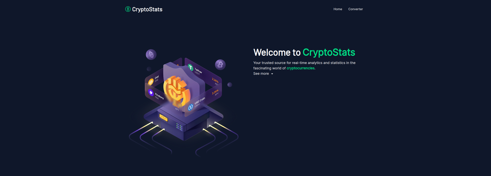

# Crypto Stats

Crypto Stats is a simple converter for cryptocurrencies. It uses the CoinGecko API to get the latest data.

## Screenshots



[Preview](https://crypto-stats-three-tau.vercel.app/)

## Installation

```bash
# first clone the repository
git clone https://github.com/wesleyara/crypto-stats

# enter the project directory
cd crypto-stats

# install the dependencies
npm install 
# or
yarn
``` 

## Usage

```bash
# run the project
npm start
# or
yarn start
```

### Docker

For this project, you can also use Docker. Just run the following commands:

```bash
# build the image
docker build -t crypto-stats .

# run the container
docker run -d -p 3000:3000 --name crypto-stats crypto-stats
```

## Technologies and tools

- [Nuxt.js](https://nuxtjs.org/) for the frontend
- [Tailwind CSS](https://tailwindcss.com/) for styling
- [Nuxt UI](https://ui.nuxt.com/) for the UI components
- [Vueuse](https://vueuse.org/) for the composition API
- [Eslint](https://eslint.org/) for linting
- [Prettier](https://prettier.io/) for code formatting
- [Vitest](https://vitejs.dev/guide/) for testing
- [CoinGecko API](https://www.coingecko.com/en/api) for the data
- [Docker](https://www.docker.com/) for containerization
- [/server](./server) for the backend api

## Explain about the project

To create the project, I first organized the entire repository, installed the necessary dependencies and the tools that would help me with the code, such as eslint and prettier. I configured some Nuxt modules to assist in development.

From there I created the first screen components, to have a user-friendly front end. After that I started doing the feature part, I made use of composables and several features present within nuxt itself.

To be able to better manage the data in /utils, I created some functions that formatted different values ​​for me, in addition to finding the most accurate values ​​for the api to return when a date was input, for example, with this I merged it with the /server directory and created a small backend that served as middleware to manage the data coming from the api.

Every application was designed with the best way to provide maintenance, always simplifying the data and working with the idea of ​​function.